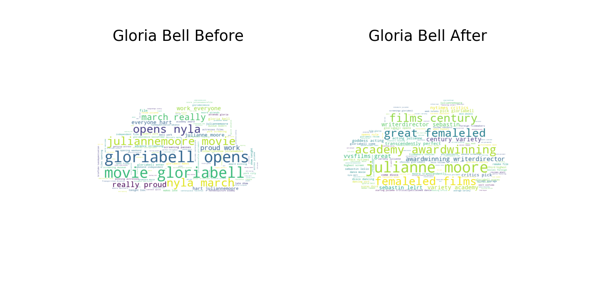
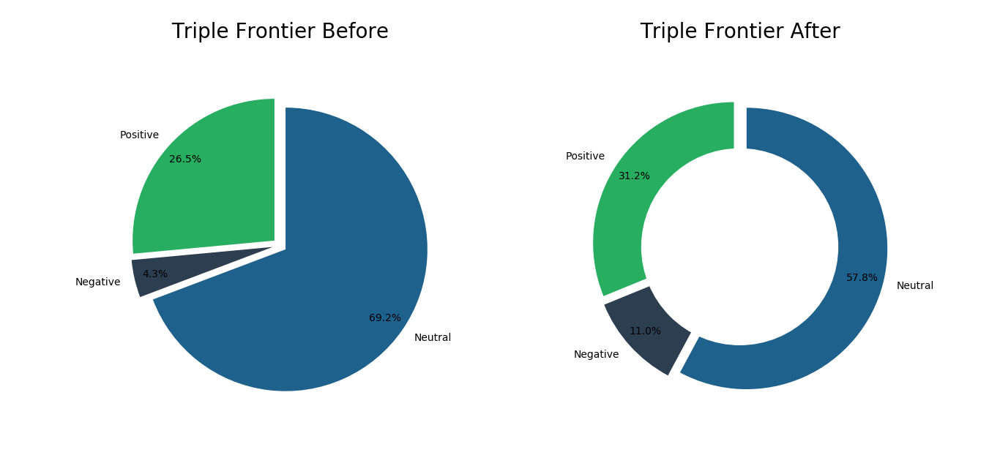

# Analysis of Movies Before/After Release

This project is going to look at the analysis of tweets on Twitter of movies 3 days before they are released and then 3 days after they are released. The selection of the movies was based around the fact that the Twitter API only allows tweets no older than around 7 days to be collected. The tweets will be collected by searching for the hashtag name of the movie.

## Selected Movies
1. Captain Marvel

1. I'm Not Here

1. Triple Frontier

1. Gloria Bell

## Comparison of the Number of Tweets Tweeted

As you can see Captain Marvel had substantially more tweets while Triple Frontier came in second, then Gloria Bell and lastly I'm Not Here.

## Word Clouds (Most Common Words)

- The most common words in the before picture are marvel studio, captainmarvel, last night, and theater. The most common words in the after picture are follow original funko, higher faster, captainmarvel, and brielarson.

- The most common words in the before picture are gloriabell, opens, movie, nyla march, and juliannemoore. The most common words in the after picture are juliannemoore, academy awardwinning, great femaleled films, films century, and transcendently perfect.

- The most common words in the before picture are triplefrontier, charlie hunnam, carpet, reveals heist, and talk working. The most common words in the after picture are charlie hunnam, oscar isaac, triplefrontier, select theaters, and netflix select. 

- There are not many most common words due to the fact it was not tweeted as much as the others but the most common words in the before picture are imnotheremovie, preorder tickets, tickets, and special screening. The most common words in the after picture are imnotheremovie, playing platforms, netowrk, fandangonwrt, and dish network. 

## Sentiment Analysis

- Captain Marvel received more positive tweets after it was released. It also had a lower amount of negative tweets after release.

- Gloria Bell had fewer positive tweets after it was released and had a 12% increase in negative tweets.

- Triple Frontier had a lot of neutral tweets especially in the before release chart. The amount of negative tweets increased more than the amount of positive tweets after the movie was released.

- I'm Not Here also had a large amount of neutral tweets in the before release chart. It grew by a large amount in the positive number of tweets after it was released by around 50%. The amount of negative tweets increased by around 19%.
